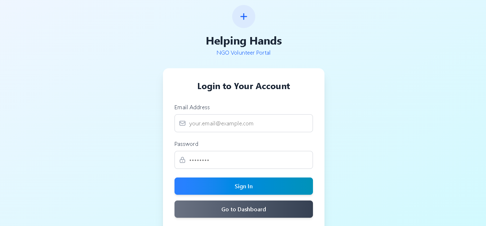
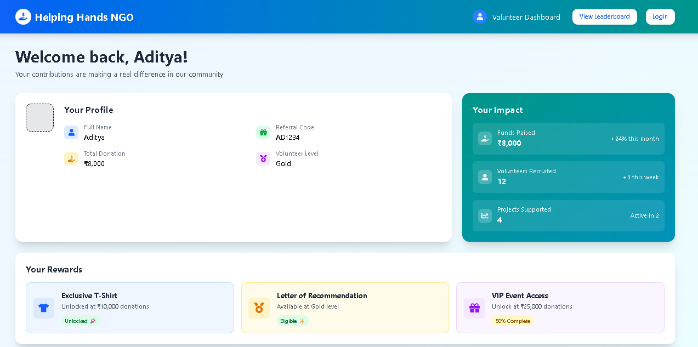
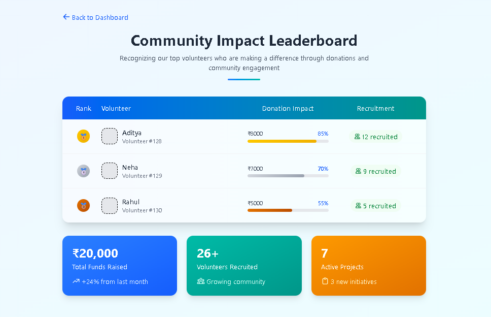

# 🌍 Fundraising Intern Portal – Helping Hands NGO

A full-stack portal for NGO volunteers and interns to track fundraising, monitor progress, and engage with team members. Built with React.js and Node.js/Express, this application offers a responsive and intuitive dashboard experience.


## 🚀 Tech Stack

- **Frontend**: React.js, Tailwind CSS, React Router DOM, Framer Motion
- **Backend**: Node.js, Express.js
- **Data**: `data.json` (can be replaced with a database later)
- **Icons**: Heroicons, SVG


## ✨ Features

- 📊 **Dashboard** with donations, volunteer stats, and progress bar
- 🏆 **Leaderboard** sorted by top performers
- 🔐 **Login / Signup** screens
- 📱 Fully **responsive** for desktop and mobile
- 🔄 Dynamic data fetching from Express server


## 🌐 Live Demo

👉 [Click here to view the live site](https://fundraising-intern-portal-lyart.vercel.app/) 


## 💻 How to Run Locally

### 1. Clone the repository

```bash
git clone https://github.com/cyberfortify/fundraising-intern-portal.git
cd fundraising-intern-portal
````


### 2. Start the server

```bash
cd server
npm install
node index.js
# Server will run at http://localhost:3001
```


### 3. Start the client

```bash
cd ../client
npm install
npm run dev
# Client will run at http://localhost:5173 (or similar)
```


## 🖼️ Screenshots

### ✅ Login Page



### ✅ Dashboard



### ✅ Leaderboard




## 📁 Project Structure

```
fundraising-intern-portal/
├── client/        # React frontend
├── server/        # Express backend + data.json
├── screenshots/   # UI screenshots for README
├── README.md
└── .gitignore
```


## 🙌 Credits

Built with ❤️ by [Aditya Vishwakarma](https://github.com/cyberfortify)


## 📃 License

This project is open-source and available under the [MIT License](LICENSE).

